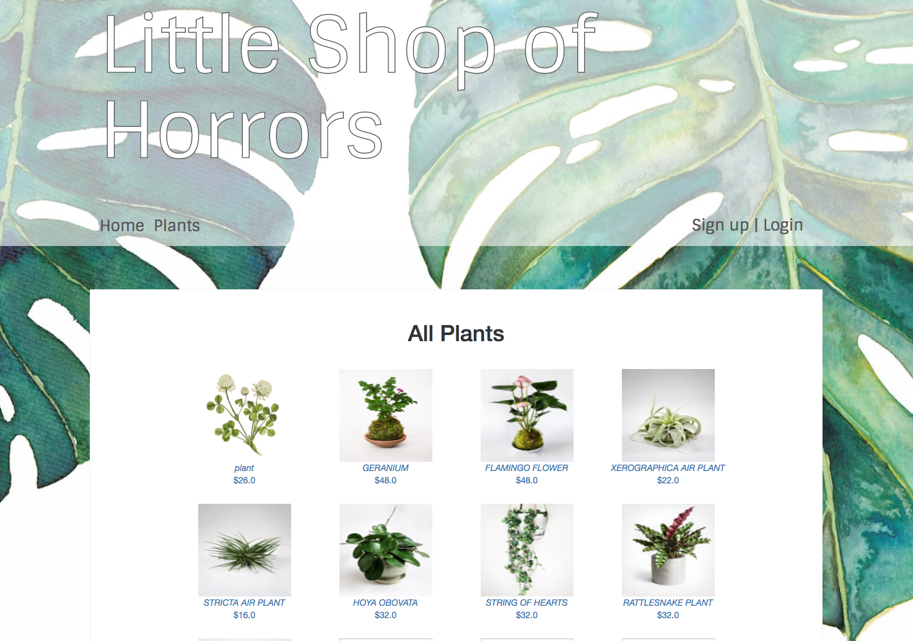

# _Plant Store_

#### _An application for creating and maintaining an online store with reviews. Complete with user authentication and user shopping cart_

#### By _**Kat Gifford & Kai De Rochemont**_

_Products Page:_


## Setup/Installation Requirements

* _Clone the repo_
* _Run the following commands in the root of the project to set up the application_
```
$ bundle install
$ rails db:create
$ rails db:setup
$ rails s
```
### Accounts
The default credentials provided below, will allow you to see the website as a admin user. You may also sign up with your own information.

| Type | Email | Password |
| ---- | ----- | -------- |
| user | user@user.com | password |
| admin | admin@admin.com | password |

## Technologies Used

* _HTML5/SCSS_
* _Rails_
* _Ruby_
* _Rspec_
* _Capybara_
* _Faker_


### License

*This is web page is licensed under the MIT License.*

Copyright (c) 2017 **_Kat Gifford & Kai DeRochemont_**
